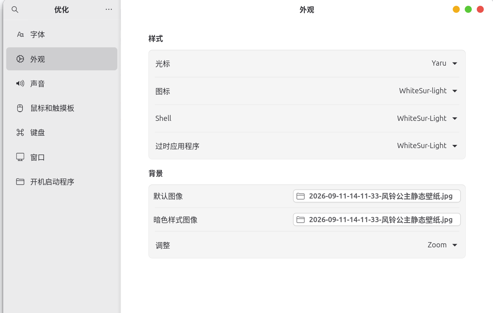
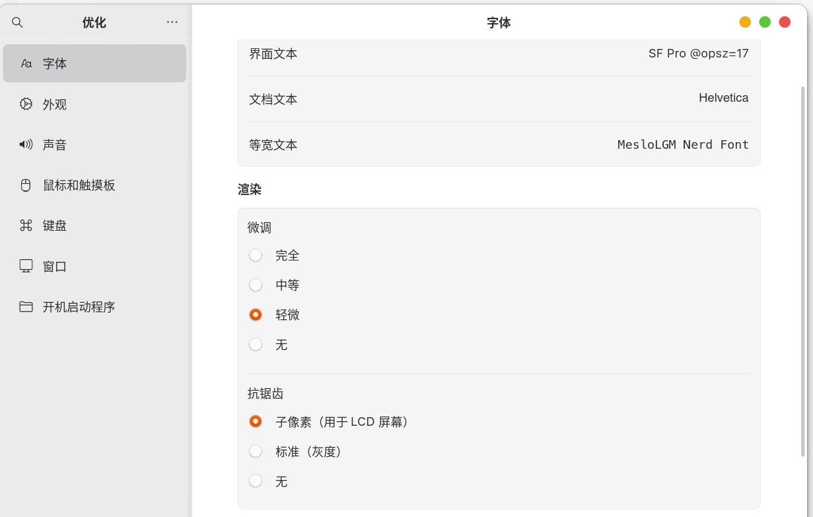

<br />

***

## 优化.md

### 一、输入法

```
1. 设置键盘， 常规 -> 候选词排序顺序 ：词频
```

```
2. 开启云输入
```

> 打开输入法的云端联想功能，输入时可以从服务器获取候选词。同样在图形界面里设置。

***

### 二、删除 Snap （有风险，可选）

```bash
sudo snap remove --purge $(snap list | awk 'NR>1 && $1!="snapd" {print $1}')
```

> * `snap list`：列出所有已安装的 Snap 包。
> * `awk 'NR>1 && $1!="snapd" {print $1}'`：跳过第一行表头（`NR>1`），排除 `snapd` 自身（`$1!="snapd"`），只输出包名。
> * `snap remove --purge`：删除这些包，`--purge` 同时清除它们的配置和用户数据。
> * 整条命令的作用是：**删除除 snapd 之外的所有 Snap 应用**。snapd 必须留到最后删，否则其他 Snap 会失去依赖。

```bash
sudo apt purge snapd
```

> 卸载 snapd 守护进程本身。这会删除 `/snap`、`/var/lib/snapd`、`/var/cache/snapd` 等系统目录。`purge` 比 `remove` 更彻底，连配置文件一起删。

```bash
rm -rf ~/snap ~/.snap
```

> 删除用户主目录下的 Snap 残留数据。`apt purge snapd` 不会自动清理用户目录，需要手动删。

```bash
sudo tee /etc/apt/preferences.d/nosnap.pref > /dev/null <<'EOF'
Package: snapd
Pin: release o=Ubuntu
Pin-Priority: -1
EOF
```

> 创建一个 APT 优先级配置文件。`Pin-Priority: -1` 表示**永远不要自动安装 snapd**。这样以后安装 `firefox` 等空壳包时，APT 不会偷偷把 snapd 拉回来。

```bash
sudo apt update
```

> 刷新 APT 软件包列表，让刚才的优先级配置生效。

**重启需求：建议重启。** 卸载 snapd 后，部分依赖 Snap 的组件（如 Firefox、App Center）会失效，重启可以避免残留进程干扰。

***

### 三、Dock 行为

```bash
gsettings set org.gnome.shell.extensions.dash-to-dock click-action 'minimize'
```

> 设置点击 Dock 图标的行为为“最小化”。再次点击已聚焦的图标，窗口会最小化；再点一次恢复。解决“点击图标没反应”的问题。

```bash
gsettings set org.gnome.shell.extensions.dash-to-dock always-center-icons true
```

> 让 Dock 图标始终居中，而不是靠左排列。`true` 表示启用居中。

```bash
gsettings get org.gnome.shell.extensions.dash-to-dock extend-height
```

> 查看 `extend-height` 的当前值。如果返回 `true`，说明 Dock 是“面板模式”，会横跨整个屏幕边缘。

```bash
gsettings set org.gnome.shell.extensions.dash-to-dock extend-height false
```

> 关闭面板模式。Dock 会收缩到刚好容纳图标的大小，实现“跟随图标动态调整”。

**重启需求：无需重启，立即生效。** 如果没变化，注销再登录一次。

***

### 四、主题美化

\<!--  参考：<https://www.cnblogs.com/Undefined443/p/18133703> -->

```bash
sudo apt install -y gnome-tweaks gnome-shell-extensions
```

> 安装 GNOME Tweaks（图形化调整工具）和 GNOME Shell Extensions（扩展基础包）。`-y` 表示自动确认，不询问。

```bash
gnome-extensions enable user-theme@gnome-shell-extensions.gcampax.github.com
```

> 启用 User Themes 扩展。这个扩展本身不提供主题，它只是“解锁”自定义 Shell 主题的功能。没有它，Tweaks 里的 Shell 主题选项是灰色的。

```bash
git clone https://github.com/vinceliuice/WhiteSur-gtk-theme.git --depth=1 && cd WhiteSur-gtk-theme
```

> 下载 WhiteSur GTK 主题源码。`--depth=1` 表示只克隆最近一次提交，加快下载速度。`&&` 表示前一条成功后，进入主题目录。

```bash
./install.sh -l
```

> 运行安装脚本。`-l` 表示同时安装 libadwaita 版本，把主题写入 `~/.config/gtk-4.0`，让使用 libadwaita 的应用（如 GNOME 设置、文件管理器）也能应用主题。

```bash
sudo ./tweaks.sh -g -b "/home/你的用户名/Pictures/你的壁纸.jpg"
```

> 安装 GDM 登录界面主题。`-g` 指定 GDM，`-b` 指定背景图片路径。**需要 sudo**，因为要修改系统级的登录界面文件。路径必须改成你自己的实际壁纸路径。

```bash
cd ..
```

> 返回上一级目录，准备克隆下一个仓库。

```bash
git clone https://github.com/vinceliuice/WhiteSur-icon-theme.git --depth=1 && cd WhiteSur-icon-theme
```

> 下载 WhiteSur 图标主题源码，并进入目录。

```bash
mkdir -p ~/.icons
```

> 创建 `~/.icons` 目录。`-p` 表示如果目录已存在就不报错，需要时自动创建父目录。

```bash
./install.sh -a
```

> 安装图标主题。`-a` 表示安装 alternative 版本，即重新设计的图标，和原版 macOS 风格略有不同。

***

### 五、字体（可选，ubuntu 26 字体+界面已经挺不错的了）

```bash
git clone https://github.com/sahibjotsaggu/San-Francisco-Pro-Fonts.git --depth=1
```

> 下载 San Francisco Pro 字体库。这是苹果系统的标准字体。

```bash
sudo mkdir -p /usr/local/share/fonts/SF-Pro
```

> 在系统字体目录下创建 SF-Pro 文件夹。`/usr/local/share/fonts` 是系统级字体目录，所有用户都能使用。

```bash
sudo cp San-Francisco-Pro-Fonts/SF-Pro* /usr/local/share/fonts/SF-Pro
```

> 把下载的 SF-Pro 字体文件复制到系统字体目录。

```bash
sudo mkdir -p /usr/local/share/fonts/Helvetica
```

> 创建 Helvetica 字体目录。

```bash
wget https://font.download/dl/font/helvetica-255.zip
```

> 下载 Helvetica 字体压缩包。

```bash
sudo unzip helvetica-255.zip -d /usr/local/share/fonts/Helvetica
```

> 解压到系统字体目录。`-d` 指定解压目标路径。

```bash
wget https://github.com/ryanoasis/nerd-fonts/releases/download/v3.2.0/Meslo.tar.xz
```

> 下载 Meslo Nerd Font 压缩包。Nerd Font 在普通字体基础上增加了图标字形，适合终端和代码编辑器。

```bash
tar -xJvf Meslo.tar.xz
```

> 解压 `.tar.xz` 文件。`-x` 解压，`-J` 处理 xz 压缩，`-v` 显示过程，`-f` 指定文件名。

```bash
sudo mkdir -p /usr/local/share/fonts/Meslo
```

> 创建 Meslo 字体目录。

```bash
sudo mv MesloLG* /usr/local/share/fonts/Meslo
```

> 把解压出来的 MesloLG 系列字体移动到系统字体目录。

```bash
sudo fc-cache -fv
```

> 刷新系统字体缓存。`-f` 强制刷新，`-v` 显示详细过程。执行后新字体才能被应用识别。

**重启需求：无需重启。** `fc-cache` 刷新后新字体即可在应用中选用。如果某些应用没立刻识别，注销一次即可。

<br />

### 六、配置

#### 6.1主题配置



#### 6.2 字体配置



<br />

<br />

**重启需求：必须注销或重启。** 安装 GDM 主题后，登录界面需要重启才会刷新；GTK/Shell 主题也需要重新登录才能完全应用。建议完成所有美化步骤后**重启一次**。

<br />

<br />

***

##
